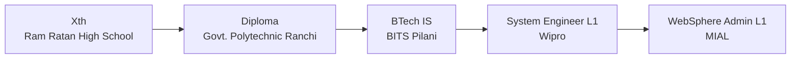

# Hi, I'm Vivek

A **BITS Pilani (WILP undergraduate)** and **Wiprolite**, passionate about
**AI, Machine Learning, UI/UX, and Full-Stack Development**.
I’m also deeply interested in **photography and sketching**, which shape my creative approach to technology.

---

## Skills & GitHub Activity

<table width="100%">
<tr>
<td width="50%" align="left" valign="top">

### Languages & Tools

</td>
<td width="50%" align="left" valign="top">

### Contribution Stats

</td>
</tr>
</table>

---

## Education & Professional Journey

## Achievements

  
  
  

## Let’s Connect

  
  
  
  
  

